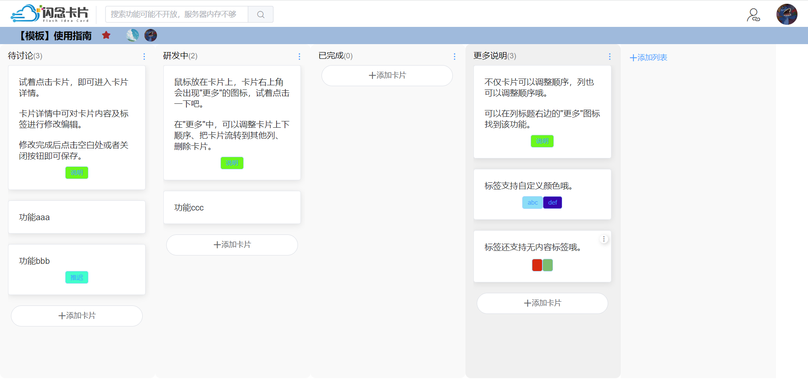

# 项目介绍

本项目是基于spring cloud alibaba的看板工具平台项目

测试：https://fic.zway.top/

前端：https://github.com/longjuan/flash_idea_card_ui





# 技术栈

* spring cloud alibaba
* redis
* rabbitmq
* elasticsearch
* docker

# 目录结构

```bash
.
├── fic-auth # 登录授权模块
├── fic-common
│   ├── fic-common-base # 基础依赖
│   ├── fic-common-redis # redis基础依赖
│   └── fic-common-web # web基础依赖
├── fic-gateway # 网关
├── fic-kanban # 看板模块
├── fic-mail # 邮件模块
├── fic-search # 搜索模块
└── fic-user # 用户模块
```

# 配置文件示例

在每个`resources`文件夹下的`fic-xxx-dev.yaml.nacos.example`

# SQL文件
`./sql`文件夹下
